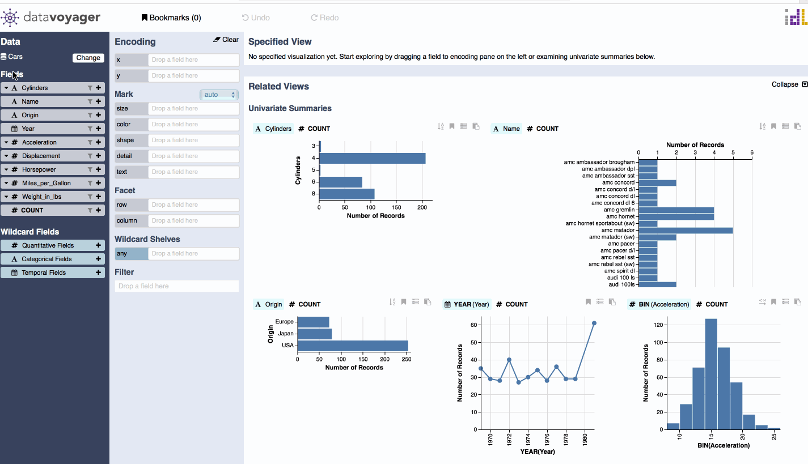

# Data Fields

Users can add fields to the Encoding Panel by clicking the Plus Button on the right of the field pill, or by dragging a field into an encoding shelf.

 Underneath the Fields section is a list of data fields from the dataset. From left to right, in a field pill, there is:

1.  A dropdown for changing the field's type if applicable
2.  A symbol that represents the field's type \(**A** for categorical, **Calendar** for temporal, **\#** for quantitative\) 
3. The field name
4. The filter button
5. The auto add to encoding shelf button

