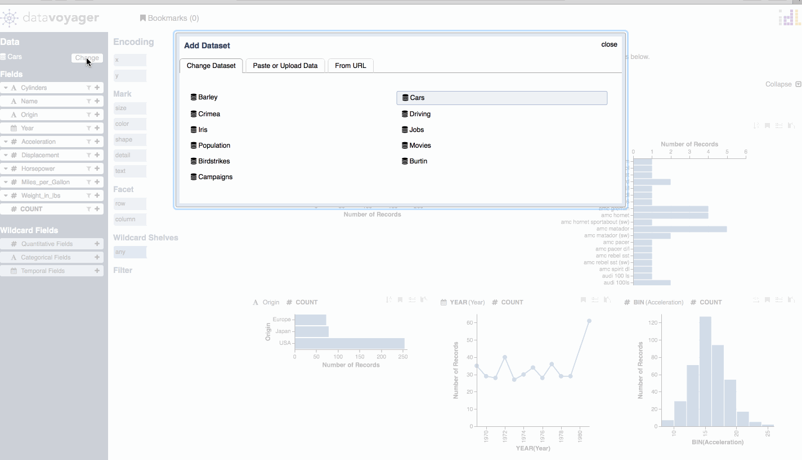
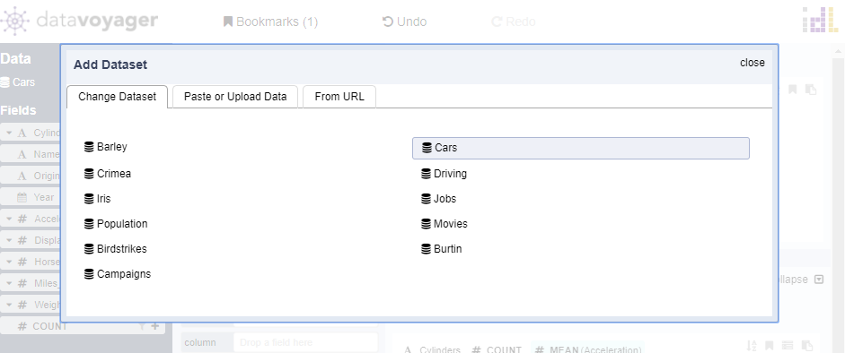
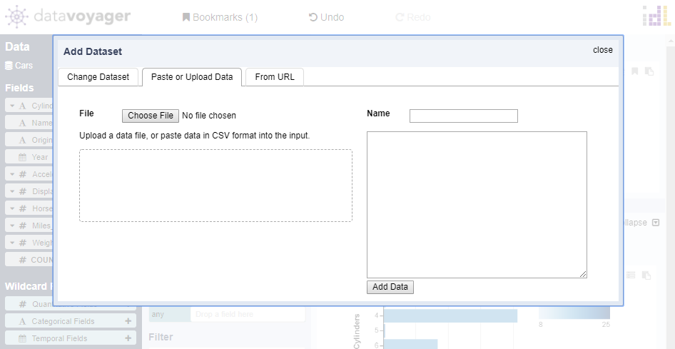
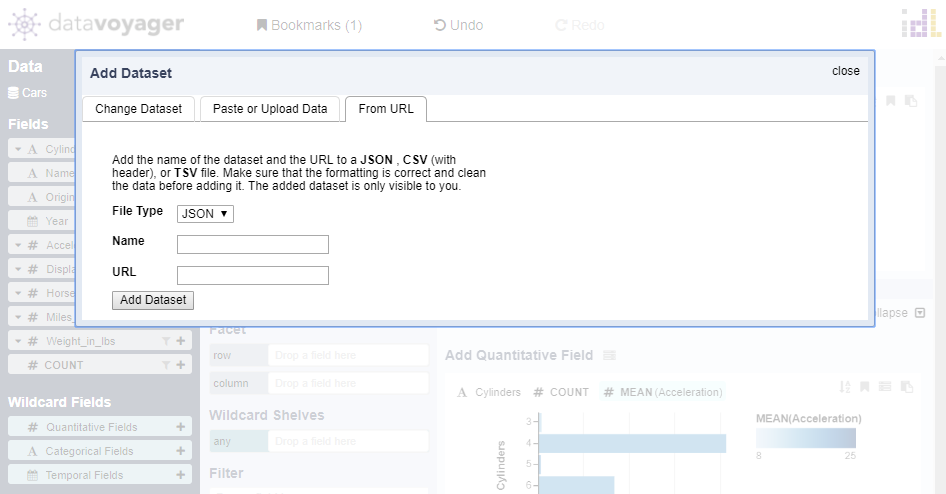

# Load Data

To select and load data, click Change Dataset in the Data Panel. A modal will appear with several tabs: **Change Dataset**, **Paste or Upload Data**, **From URL.**

#### Change Dataset:

This tab contains a list of preset datasets that users can explore. 

#### Paste or Upload Data:

Upload a CSV, TSV, or JSON file or paste data in CSV format into the input box. 

#### From URL

Upload a CSV, TSV, or JSON file from URL. Make sure that the formatting is correct and clean before adding the data in. The added dataset is only visible to you. 

