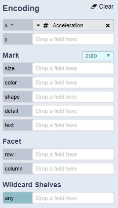

# Encoding Shelves

The encoding shelves are grouped into positional channels \(e.g. x, y\), mark channels \(e.g. size, color, shape, detail, text\), and facet channels \(e.g. row, column\). 

To visualize data, analysts can drag-and-drop a data field onto an encoding channel shelf \(e.g., x, y, color\). By default, the system encodes raw \(unaggregated\) values. 

 Via a drop-down menu, analysts can select a transformation such as an aggregation, binning, or time unit function.

