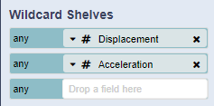
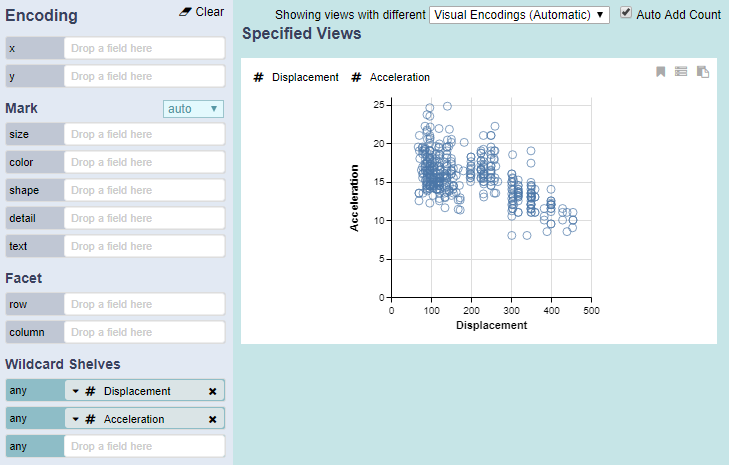

# Wildcard Shelves

Wildcard shelves allow users to add fields without selecting a specific channel, allowing the system to suggest appropriate encodings.

The screenshot above shows that the system automatically encoded the two quantitative fields onto the x and y axis since they were the most perceptually effective and expressive channels available.

