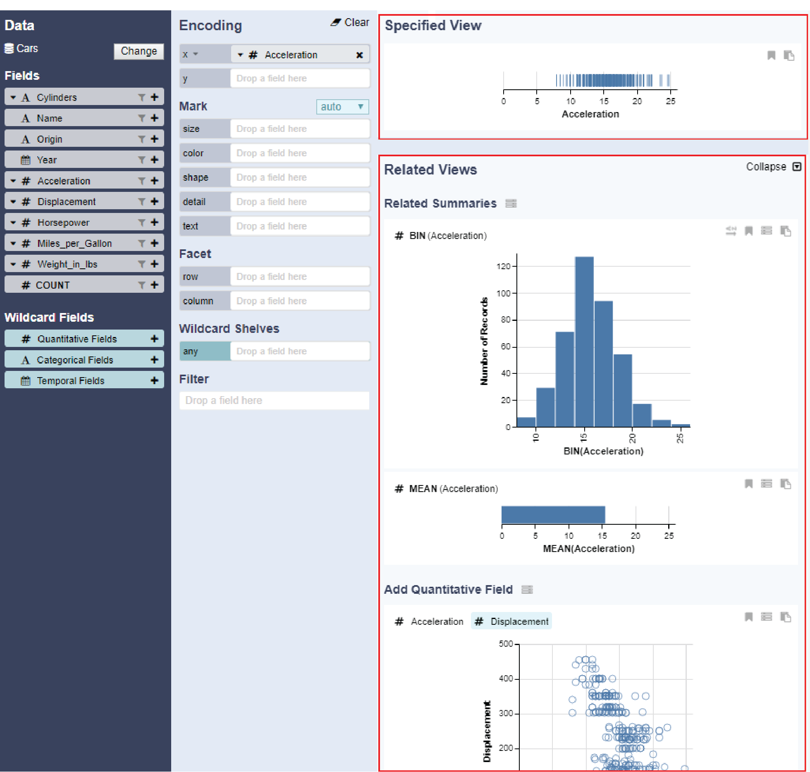

# Specified Views and Related Views Panel

As encodings are modified, the specified view and related views panels in the rightmost column update accordingly. Each view contains toolbar buttons for modifying axes, sorting, and bookmarking. Users can hover over a chart element to reveal a tooltip describing the underlying data point.

