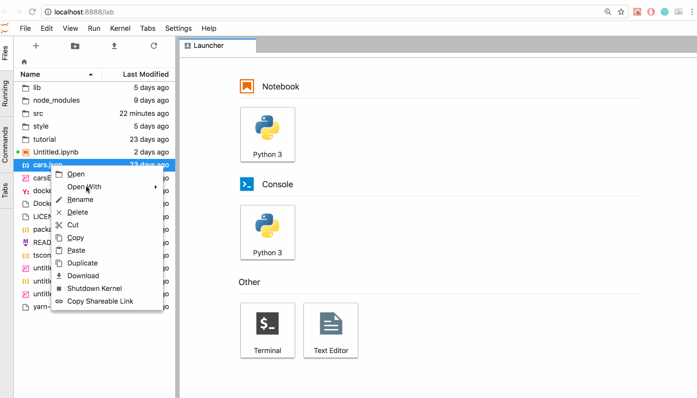
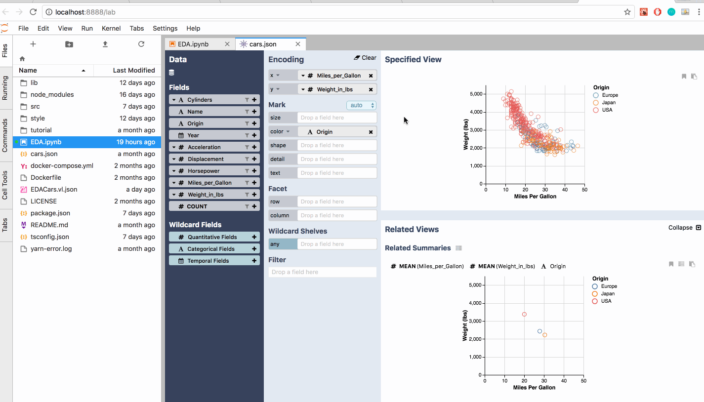
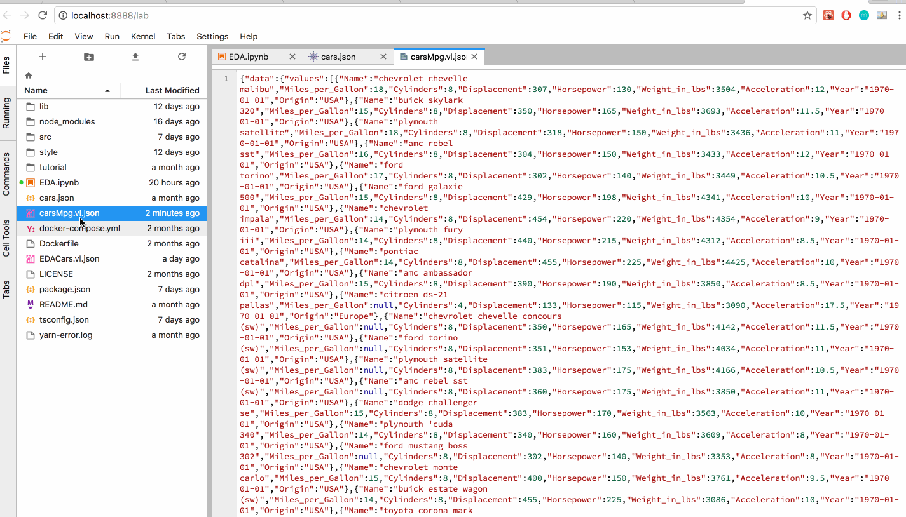

# Using Voyager in JuypterLab

### **Given a Data Source, Open it in Voyager**

To open local files through the context menu, right click on a valid file  \(JSON, CSV, TSV, vl.JSON\), select '`Open with`, and click `Voyager`.

### Manipulate and Explore Data in Voyager Interface

After opening the dataset in the Voyager interface, you can manipulate and explore your data, as described in the earlier sections of this [_documentation_](visualizing-data/).

### Export Data from Voyager

To save the current state of a Voyager analysis session, right click \(or ctrl+click if on Mac OS\) anywhere in the View Pane, and click the `Export Voyager as Vega-lite` option. This will generate a `vl.json` file that you can later re-open by right clicking on the file in the context menu, and clicking `Open With Voyager`.

To export the [Altair](https://altair-viz.github.io/) code to generate the specified-view as seen in Voyager, right click \(or ctrl+click if on Mac OS\) anywhere in the View Pane, and click the `Export Voyager to Notebook`option. This will prompt you to choose which Python Kernel to use. After selecting the appropriate kernel, the code will be injected into a notebook, which you can simply display by running that cell.

#### 

