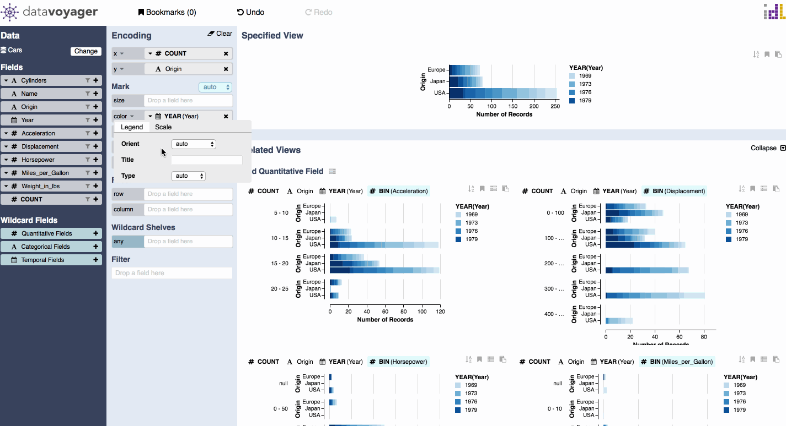

# Customizing Visualizations

Visualizations can be customized through the encoding customizer interface. If a field can be customized, you will see a carat displayed next to the name of the channel that the field is currently encoded by. Click this carat to open the encoding customizer.

