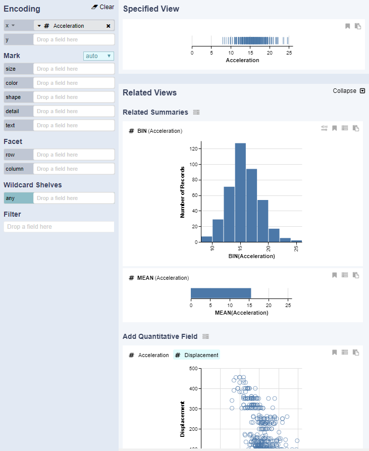

# Encoding Panel

TODO: show data pane too

The encoding panel provides controls for specifying visual encodings. It contains shelves for mapping fields to visual channels via drag and-drop, and a control for selecting mark type. Users can chose to clear the fields if desired. Data field transformations can be specified via the drop down inside a field pill that has been dragged to an encoding shelf.

