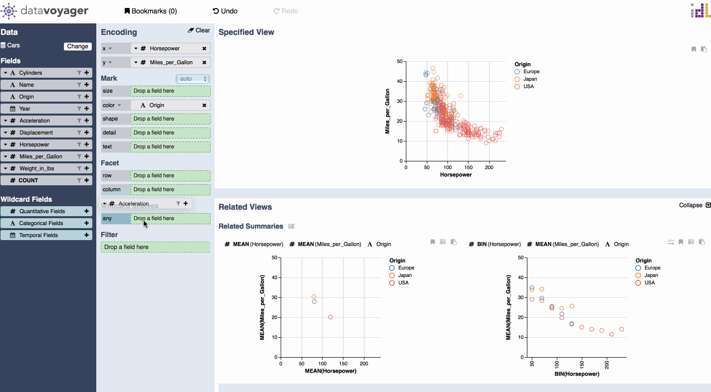

# Filter

The filter panel shows dynamic query controls for filtering. You can open the filter panel by clicking the filter icon within a field pill, or by dragging the field to the filter area. You can adjust the minimum and maximum values of a quantitative field by using a slider, or you can type in your desired min or max value. Filter nominal fields by selecting desired values from an array of checkboxes. Temporal fields are filtered using a slider that lets you adjust minimum and maximum values.

REDO:

filter: scatter plot \(ex. color scatter plot with origin...or filter categories by USA/fields/etc.\)

