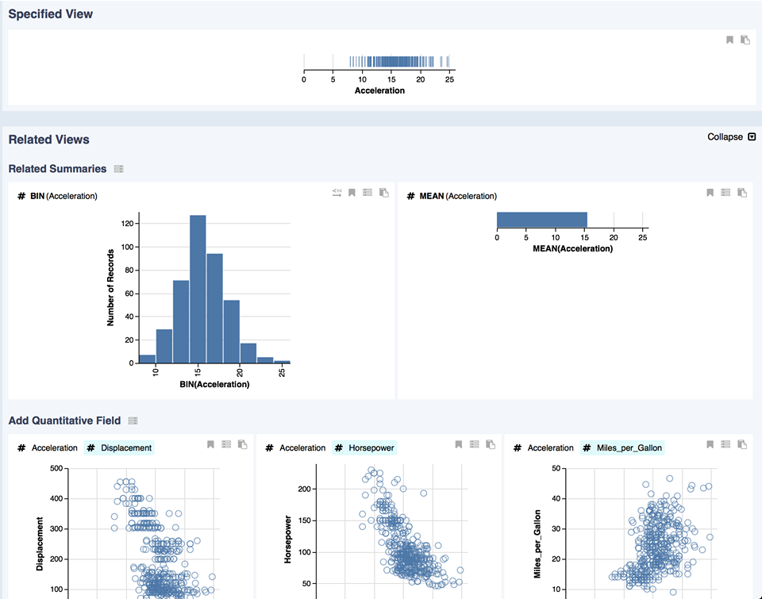
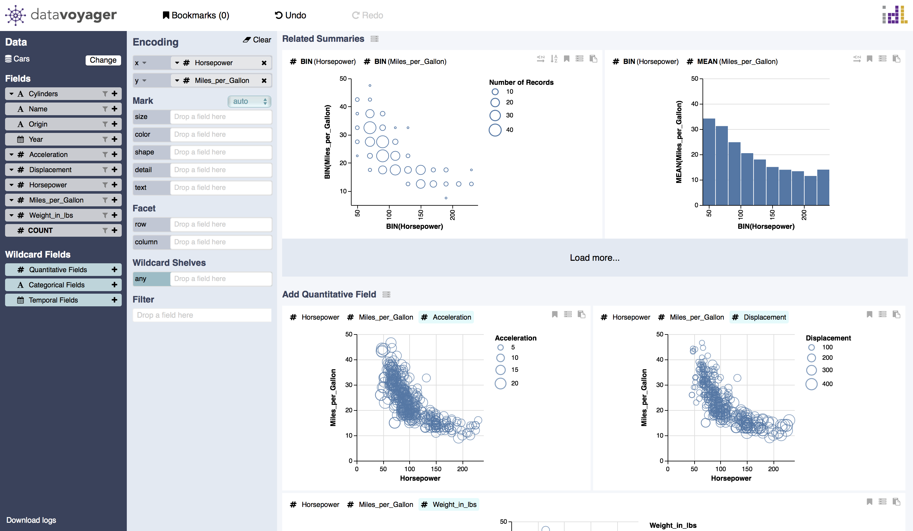

# Related Views

Related Views automatically recommends charts based on your currently specified view, promoting discovery of relevant data fields and alternative ways to summarize or encode the data.

When you specify a visualization, Related Views will show [related summaries](https://data-voyager.gitbook.io/voyager/visualizing-data/related-views#related-summaries), [field suggestions](https://data-voyager.gitbook.io/voyager/visualizing-data/related-views#field-suggestion), and [alternative encodings](https://data-voyager.gitbook.io/voyager/visualizing-data/related-views#alternative-encodings) in different sections underneath the current view.

#### Related Summaries

Related Summaries are a part of related views and present aggregate plots to augment a focus view showing raw data. 

#### Field Suggestion

Field suggestions show the results of encoding one additional field within the focus view.

#### Alternative Encodings 

Alternative encodings display other options for visualizing the same data \(data fields and transformations identical to the focus view\) when there are multiple effective encodings. For example, you can encode origin using a partitioned trellis plot in addition to using a color encoding, or use area mark instead of line.

