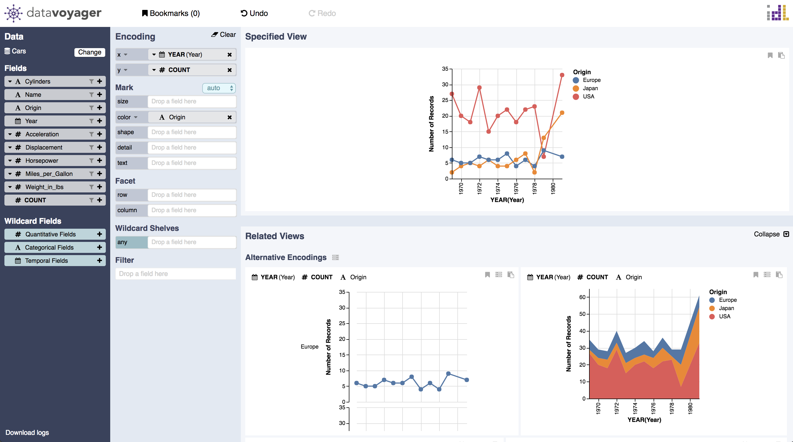

# Alternative Encodings

Alternative encodings display other options for visualizing the same data \(data fields and transformations identical to the focus view\) when there are multiple effective encodings. For example, analysts can encode origin using a partitioned trellis plot in addition to using a color encoding.

