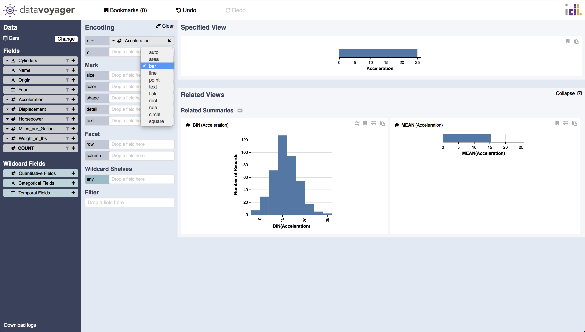
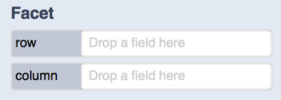
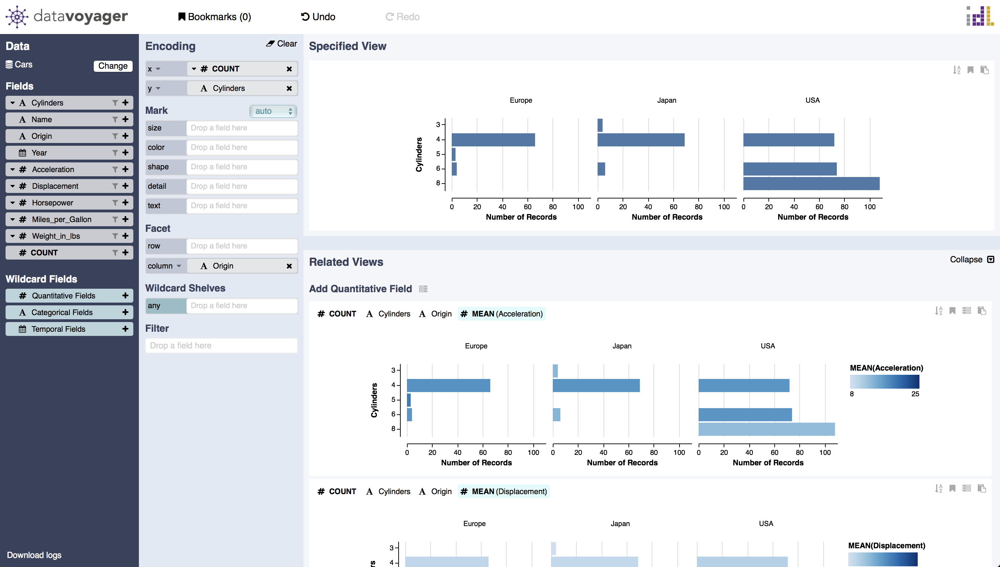

# Specify Visual Encodings

### Encoding Shelves

The encoding shelves are grouped into positional channels \(e.g. x, y\), mark channels \(e.g. size, color, shape, detail, text\), and facet channels \(e.g. row, column\).

To visualize data, analysts can drag-and-drop a data field onto an encoding channel shelf \(e.g., x, y, color\). By default, the system encodes raw \(unaggregated\) values. 

Via a drop-down menu, analysts can select a transformation such as an aggregation, binning, or time unit function.

### Mark Selection

By default, the system automatically picks an appropriate mark type. Analysts can override this choice using a drop-down menu.

### Facet

The row and column channels can be used to create vertical facets and horizontal facets for trellis plots.

