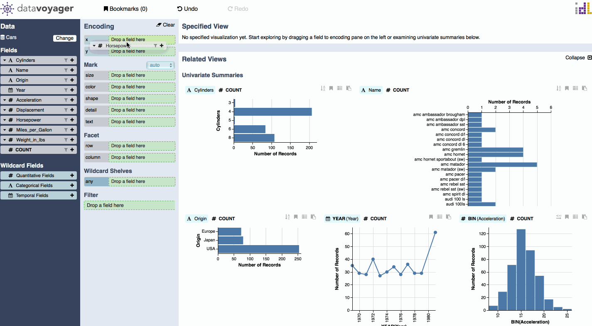
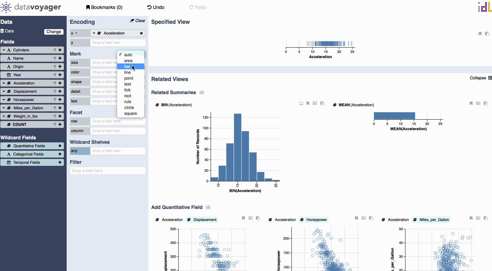

# Specify Visual Encodings

### Encoding Shelves

The encoding shelves are grouped into positional channels \(e.g. x, y\), mark channels \(e.g. size, color, shape, detail, text\), and facet channels \(e.g. row, column\). 

To visualize data, you can drag-and-drop a data field onto an encoding channel shelf \(e.g., x, y, color\). By default, the system encodes raw \(unaggregated\) values. You can select a transformation such as an aggregation, binning, or time unit function via a drag-and-drop menu \(not shown\).

### Mark Selection

By default, the system automatically picks an appropriate mark type. You can override this choice using a drop-down menu.

### Facet

The row and column channels can be used to create vertical facets and horizontal facets for trellis plots.

### Quantitative Field Function Pop-up

Quantitative fields have a function pop-up for specifying various aggregations and bin.

### Temporal Field Function Popup

Temporal fields have a function pop-up for specifying various time-unit functions.

