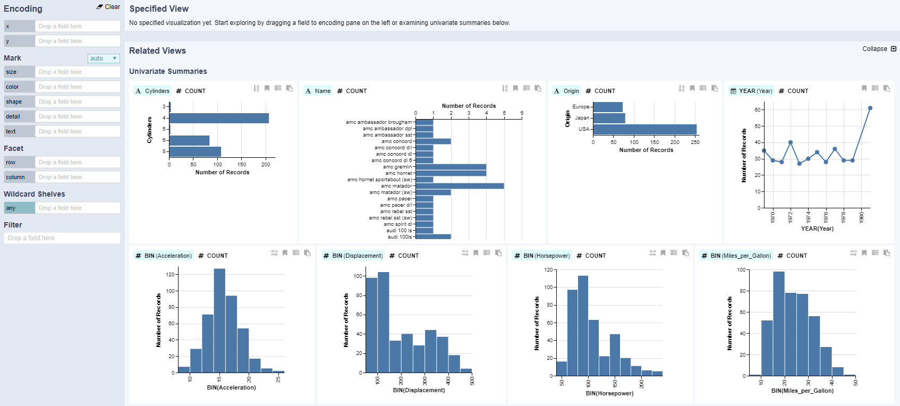

# Univariate Summaries

Upon loading a dataset, related views show univariate summaries for all fields.

Univariate summaries show distributions for all data fields when no focus view is specified. 
This view can help you familiarize yourself with the different data fields without the need to create these distribution plots yourself. 

