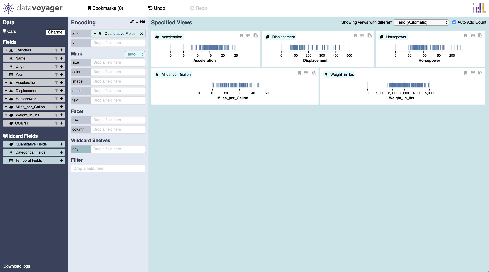
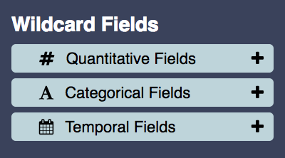
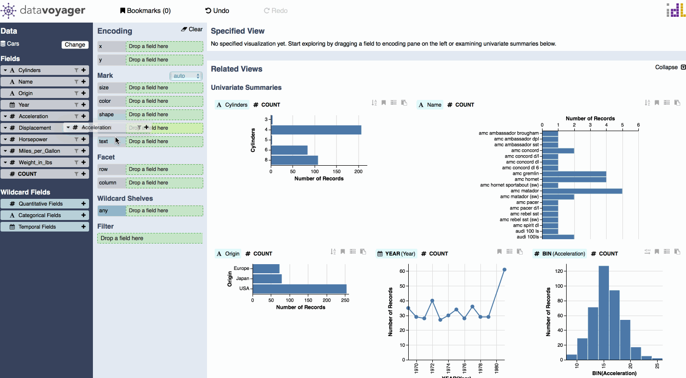
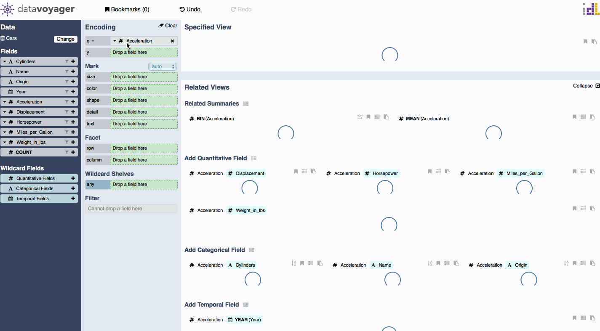

# Wildcards

There are three types of wildcards: Wildcard Fields, Wildcard Shelves and Wildcard functions.

### Wildcard Fields

Wildcard fields let you create multiple views in parallel by enumerating over a set of fields. Quantitative, Categorical, and Temporal field wildcards are provided by [default](wildcard-fields.md#preset-wildcard-fields), though you can manually author [custom](wildcard-fields.md#custom-wildcard-fields) wildcards containing the desired fields.

To create a wildcard for a specific set of fields, analysts can author a custom wildcard field by dragging desired fields to the wildcard list. To avoid incongruous views, Voyager prevents analysts from creating custom wildcard fields containing multiple data types. 

#### Preset Wildcard Fields

These wildcards represent all fields of a particular data type \(Quantitative, Categorical, and Temporal\). You can simply drag-and-drop a wildcard field onto an encoding shelf to create multiple charts in parallel. 

#### Custom Wildcard Fields

To create a wildcard for a specific set of fields, you can author a custom wildcard field by dragging desired fields to the wildcard list. However, to avoid incongruous views, you are prevented from creating custom wildcard fields that contain multiple data types.

### Wildcard Shelves

Wildcard shelves let you add fields without selecting a specific channel, allowing the system to suggest appropriate encodings.

The screenshot below shows that the system automatically encoded the two quantitative fields onto the **x** and **y** axis since they were the most perceptually effective and expressive channels available.

### Wildcard Function

Wildcard functions allow simultaneous specification of data field transformations. Checking the wildcard checkbox in an encoding shelf’s drop-down menu enables a wildcard function. Once enabled, the radio buttons for each function become check-boxes, allowing you to select which functions to include. The encoding shelf capsule denotes the use of wildcard functions with “?”.

