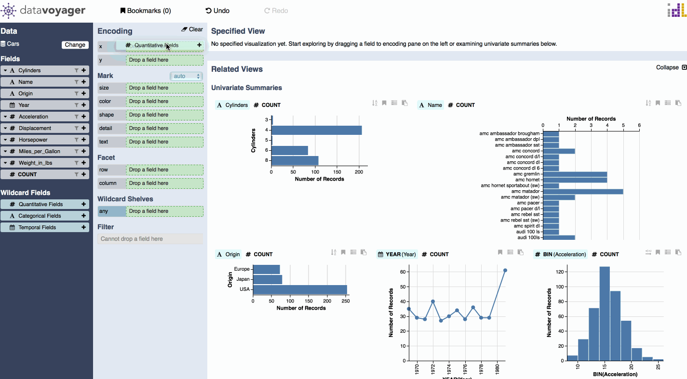

# Preset Wildcard Fields

These wildcards represent all fields of a particular data type \(Quantitative, Categorical, and Temporal\). You can simply drag-and-drop a wildcard field onto an encoding shelf to create multiple charts in parallel.

