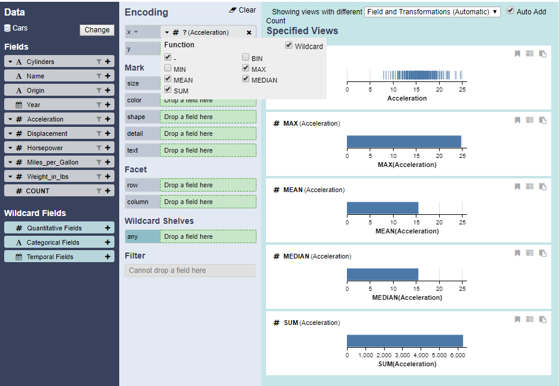

# Wildcard Function

Wildcard functions allow simultaneous specification of data field transformations. Checking the wildcard checkbox in an encoding shelf’s drop-down menu enables a wildcard function. Once enabled, the radio buttons for each function become check-boxes, allowing analysts to select which functions to include.  The encoding shelf capsule denotes the use of wildcard functions with “?”.

