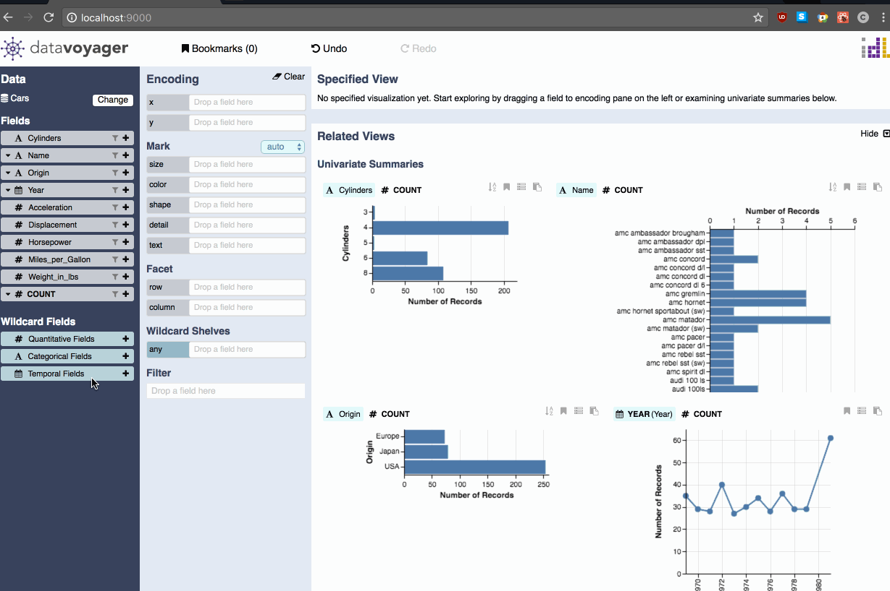

# Custom Wildcard Fields

To create a wildcard for a specific set of fields, analysts can author a custom wildcard field by dragging desired fields to the wildcard list. However, to avoid incongruous views, analysts are prevented from creating custom wildcard fields that contain multiple data types.

